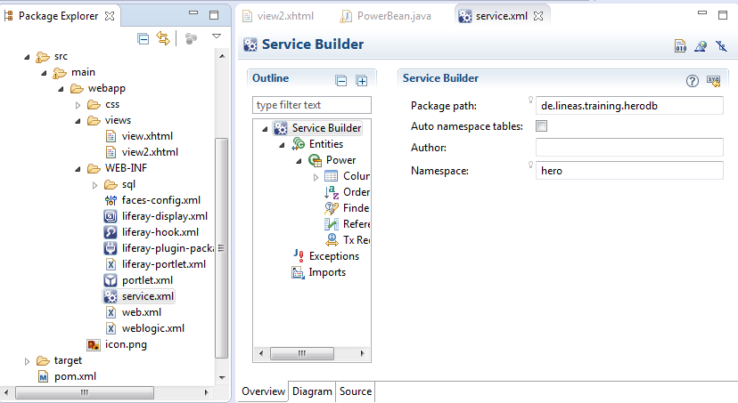

#HeroDB-Portlet


Wir wollen nun ein *Data-Driven-Portlet* implementieren, d.h. ein Portlet, welches mit Daten aus der Datenbank arbeitet. Insbesondere interessieren wir uns für die typischen **C**reate|**R**ead|**U**pdate|**D**elete Operationen.

Dazu erstellen wir ein Portlet, womit wir als Superhelden unsere Superkräfte speichern können.

##Neues Plugin Project anlegen

- Project name: herodb-portlet
- Display name: HeroDB
- Group id: de.lineas.training.herodb
- Active profile: Liferay-v6.2-CE-(Tomcat-7)

JSF, IceFaces

>**Hinweis:** Liferay-Portlet-Projektnamen haben auf `-portlet` zu enden.

**Profil aktivieren:**

In der `\herodb-portlet\pom.xml` das Profile mit dem zu ergänzenden Block `<activation>` aktivieren:


```XML
	<profile>
		<id>...</id>

		<!-- Activation-Block einfügen -->
		<activation>
			<activeByDefault>true</activeByDefault>
		</activation>

		<properties>
			<propertie>...</propertie>
		</properties>
	</profile>
```

**Dependencies:**

Die selbe Datei `\herodb-portlet\pom.xml` ist zu ergänzen mit folgenden Block:

```XML
<dependency>
    <groupId>com.google.guava</groupId>
    <artifactId>guava</artifactId>
    <version>18.0</version>
</dependency>
```
    
>Wir binden an dieser Stelle [Google Guava](https://code.google.com/p/guava-libraries/) ein. Dies ist eine Hilfsbibliothek, die Java um einige Funktionaliäten erweitert, sodaß wir besser lesbaren Code schreiben können. So können wir statt:
>
> ```java
>       String s = ....;
>       if (s != null && ! s.empty())
>```
>
>schreiben:
>
> ```java
>       if (! Strings.isNullOrEmpty(s))
> ```

	

Nun testen wir, ob das Portlet mit Maven gebaut werden kann. Dazu Konsole im Hauptverzeichnis des Portlets öffnen (`C:\liferay\workspace\herodb-portlet`), und folgenden Befehl absenden:

    mvn package

Hier sollte es zu einer Meldung kommen:

    ----------------
    BUILD SUCCESS
    ----------------


##Service-Beschreibung anlegen

Um mit der Datenbank zu Arbeiten, stellt Lifeay den sogenannten `Service-Builder` zur Verfügung. Dieser stellt sicher, dass alle Portlets einheitlich auf die Datenbank des Portals zugreifen.

> **Achtung:** Es wird dringend davon ageraten, selber *etwa per SQL* auf der Datenbank zu arbeiten. Liferay behählt einen Cache der Daten vor. Im schlimmsten Fall kann es bei Abweichungen zu inkonsistenten Daten kommen.

Für uns als Entwickler bedeutet dies, dass wir alle Datenbank-Aufgaben mit dem Service-Builder realisieren können und müssen.

> **Hinweis:** _Sollte denn noch die Datenbank direkt manipuliert werden, so ist der Webserver tomcat für Liferay neu zu starten, damit er von der Änderung erfährt._


###Service-xml anlegen

Wir fangen an, indem wir unser Modell in *XML-Form* beschreiben. Dazu erstellen wir die Datei `herodb-portlet/src/main/webapp/web-inf/service.xml`.

Die Eclipse erkennt sofort, dass es sich dabei um eine besondere Datei handelt und öffnet sie deshalb in der Ansicht des Service-Builders.

Hier auf den Eintrag `Service-Builder` klicken, worauf hin im rechten Bereich ein Formular eingeblendet wird. Hier tragen wir folgende Werte ein:

- Package path: `de.lineas.training.herodb`
- Namespace: `hero`

  


Der *Package path* legt den Paketnamen fest, unter dem die später erzeugten Dateien abgelegt werden. Der *Namespace* dient als Präfix für die Tabellennamen, um Namenskonflikte mit anderen Portlets zu vermeiden.

Wenn wir dies mit Strg+s speichern, schreibt Eclipse folgendes in unsere XML:

```XML
<?xml version="1.0" encoding="UTF-8"?>
<!DOCTYPE service-builder PUBLIC "-//Liferay//DTD Service Builder 6.2.0//EN" "http://www.liferay.com/dtd/liferay-service-builder_6_2_0.dtd">
<service-builder package-path="de.lineas.training.herodb">
    <namespace>hero</namespace>
</service-builder>
```

Nun estellen wir eine erste Tabelle: *Power*. In dieser sollen verschiedene "Superkräfte" unserer Helden gespeichert werden. Dafür brauchen wir drei Spalten:

- long PowerId (Primärschlüssel)
- String PowerName (Name des Helden)
- String PowerDescription (Beschreibung seiner "Superkraft")

Um diese Tabelle im Service-Builder anzulegen, fügen wir unserer `service.xml` folgenden Abschnitt hinzu:

```XML
<entity name="Power" local-service="true" remote-service="false">
    <!-- the primary key -->
    <column name="PowerId" type="long" primary="true"></column>

    <!-- name of the super power -->
    <column name="PowerName" type="String"></column>
    <!-- short description of the super power -->
    <column name="PowerDescription" type="String"></column>
</entity>
```

Im *entity* Tag wir eine eine Entität (sprich Tabelle) definiert. Für diese Tabelle wollen wir einen *lokalen service* haben; d.h. wir wollen mit unserem Portlet darauf zugreifen. *Remote service* ist deaktiviert, weil wir nicht von außerhalb auf diese Tabellen zugreifen möchten. Andernfalls würde der Service-Builder auch einen SOAP Webservice generieren.

Anschließend werden die drei Spalten in den *column* Tags mit ihren Datentypen definiert. Die XML-Datei `service.xml` hat damit folgenden Inhalt:

```XML
<?xml version="1.0" encoding="UTF-8"?>
<!DOCTYPE service-builder PUBLIC "-//Liferay//DTD Service Builder 6.2.0//EN" "http://www.liferay.com/dtd/liferay-service-builder_6_2_0.dtd">
<service-builder package-path="de.lineas.training.herodb">
    <namespace>hero</namespace>
    <entity name="Power" local-service="true" remote-service="false">
        <column name="PowerId" type="long" primary="true"></column>
        <column name="PowerName" type="String"></column>
        <column name="PowerDescription" type="String"></column>
    </entity>
</service-builder>
```

>**Hinweis:** Alternative zum Editieren direkt in der XML-Datei kann von Eclipse auch die Formularansicht `Overview` zur Eingabe verwendet werden. Die Tabellenspalten können dann unter dem Navigationspfad `Service Builder\Entries\Power\Columns` entsprechend `Name, Type, Primary` zugetragen oder editiert werden.

&nbsp;

>**Achtung:** 
>
>Jede Änderung an der `service.xml` macht ein **Service-Builder-Durchlauf** erforderlich.
>
>Jeder Service-Builder-Durchlauf erfordert ein **Eclipse-Projekte-Update** (F5).

###Service-Builder starten

Anhand der XML-Datei `herodb-portlet/src/main/webapp/web-inf/service.xml` wird der Service-Builder die entsprechenden Service-Klassen generieren. Neben Hilfsklassen `*.Impl` werden Klassen für **Hibernate** und **Spring** (neu) erzeugt.

>**Hinweis:** Änderungen in den vom Service-Builder generierten Dateien sind zwecklos, da sie beim nächsten Service-Builder-Durchlauf überschrieben werden. Manuell getätigte Änderungen sind damit nicht mehr existent.

Der Service-Builder wird gestartet indem wir auf der Windows Konsole folgenden Befehl absenden:

    mvn liferay:build-service

Auch hier sollte Maven ein Build-Success melden.

Wenn wir nun in der Eclipse das Projekt aktualisieren (Portlet `herobd-portlet` rechtsklick `Refresh (F5)`) , sehen wir, dass einige Pakete und Klassen generiert wurden. Mit diesen Klassen können wir die Einträge in der *Power* Tabelle der Datenbank:

- lesen / auflisten
- erstellen
- bearbeiten
- löschen

Dazu jedoch später mehr. Zuerst sollten wir das Portlet einmal deployen. 


*Dazu bieten sich zwei Wege im Eclipse an:*

*a) Markiere Portleteintrag `herodb-portlet` im Package-Explorer und ziehe sie im Service-Fenster auf den Webserver `Liferay v6.2 CE Server (Tomcat 7) at localhost...` oder*

*b) Markiere im Server-Dialogfenster den Portleteintrag `herodb-portlet` und veröffentliche mit einem Rechtsklick `Redeploy` sofern das Portlet schon mal für den Webserver `Liferay v6.2 CE Server (Tomcat 7) at localhost...` zuvor veröffentlicht wurde.*

Eclipse wird daraufhin sofort mit dem Deploy beginnen und Logausgaben auf die Konsole schreiben.

Wir sollten im Log ein Eintrag wie folgt finden:

    11:39:02,018 INFO  [localhost-startStop-2][ServiceComponentLocalServiceImpl:313] Running hero SQL scripts

Dieser wird die Tabelle in der Datenbank anlegen. *FYI:* Die Scripte, von dennen hier gespochen wird, wurden vom Service-Builder in folgendem Ordner geschrieben: `/herodb-portlet/src/main/webapp/WEB-INF/sql`

Wenn wir die Datenbank nun in SQuirrelSQL betrachten, finden wir eine neue Tabelle: `HERO_POWER`

>**Hinweis:** Auch an dieser Stelle sei nocheinmal darauf hingewiesen, dass die Datenbank hier sehr wohl **betrachtet**, aber tunlichst **nicht manuell verändert** werden sollte. Liferay verwaltet die Daten in einem eigenen Cache der ggf. nicht mehr synchronisiert werden kann und Inkonsistenzen riskiert werden.


##Testdaten-Mockup

Um unsere Anwendung besser schreiben zu können, sollten wir an dieser Stelle *von Hand* Testdaten in die Tabelle schreiben. **Achtung:** Ich habe vorher gesagt, dass wir dies nicht tun sollten. Dies soll nur als Demo dienen.

Wir öffnen also die Tabelle in SQuirrelSQL und klicken mit der rechten Maustatse auf eine der Spalten. Im Kontextmenü können wir nun mit `make editable` die Tabelle editierbar machen. Nun können wir mit einem weiteren Rechtsklick auf eine der Spalte den Eintrag `insert row` wählen.

Hier erstellen wir folgende Zeile:

	- powerId: 0
	- powerName: Clean Code
	- powerDescription: Wielder can write code cleaner than Mr. Proper.


##Daten anzeigen

###Ein Controller (Bean) für die Powers

Neue Klasse erstellen: `de.lineas.training.herodb.beans.PowerBean.java`


Pfad im Package Explorer:


	herob-portlett\
		src/main/java\
			de.lineas.training.herodb.beans\
				PowerBean.java


Java-Source:


```Java
@ManagedBean
@SessionScoped
public class PowerBean {

    private List<Power> powers = new ArrayList<Power>();

    public PowerBean () {
        updatePowers();
    }

     //--- Helpers
	
    private void updatePowers () {
        try {
            powers = PowerLocalServiceUtil.getPowers(QueryUtil.ALL_POS, QueryUtil.ALL_POS);
        } catch (SystemException e) {
            e.printStackTrace();
        }
    }
	
    //--- Getters and Setters

    public List<Power> getPowers() {
        return powers;
    }
	
}
```


Mit `updatePowers(..)` veranlassen wir, dass alle vorhandenen Datensätze (aus dem Cache oder der DB) in die Memberlistvariable `powers` eingelesen werden. 

Die Klasse `Power` wurde bereits vom Service-Builder erzeugt und steht damit zur Verfügung. Sie ist in der Lage ein Datenobjekt der Tabelle `HERO_POWER` aufzunehmen. Wir haben lediglich den Pfad in unserem Source aufzulösen:

   `import de.lineas.training.herodb.model.Power;`.

Mit der Anweisung 

`powers = PowerLocalServiceUtil.getPowers(QueryUtil.ALL_POS, QueryUtil.ALL_POS);` 

Die Funktionalität wird wiederum bereits mit `PowerLocalServiceUtil.getPowers.getPowers(..)` vom Service-Builder bereitgestellt.

Die Methode `getPowers(<start>,<end>)` kennt kein `getPowers(0,end)`. Statt dessen sind beide Übergabeparameter auf `QueryUtil.ALL_POS` zu setzen.


###Eine View für die Powers

Den Body-Teil in der `/herodb-portlet/src/main/webapp/views/view.xhtml` ersetzen:

```XHTML
<h:body>
    <h3>Powers:</h3>
    <ul>
        <ui:repeat var="power" value="#{powerBean.powers}">
            <li>
                <h:outputText value="#{power.powerName}" />:
                <h:outputText value="#{power.powerDescription}" />
            </li>
        </ui:repeat>
    </ul>
</h:body>
```


Das Portlet sollte nun eine Liste mit einem Eintrag anzeigen.

 

Somit können wir Datensätze aus der Datenbank lesen und anzeigen.


##Neue Datensätze anlegen

###LocalService erweiten

Wenn wir neue Datensätze zur Datenbank hinzufügen möchten, können wir wieder *PowerLocalServiceUtil* verwenden. Diese stellt dafür jedoch nur Methoden zur Verfügung, um Power Objekte zu speichern. Wir können ein Power Objekt jedoch nicht erzeugen, da wir hierfür die nächste freie ID für den Primärschlüssel ermitteln müssten. Ingesammt wäre das zu viel Code in der View, welcher nicht in deren Verantwortungsbereich liegt.

Stattdessen erweitern wir den Service um eine Methode, die nur noch die beiden Strings für den PowerName und PowerDescription bekommt, daraus ein Power Objekt erstellt und diese in die Datenbank schreibt.

Dazu schreiben wir folgende Methode in die `/herodb-portlet/src/main/java/de/lineas/training/herodb/service/impl/PowerLocalServiceImpl.java`:

Im Eclipse sieht der Pfad im Package-Explorer dann so aus:

	/herodb-portlet/
		src/main/java/
			de.lineas/.training.herodb.service.impl/
				PowerLocalServiceImpl.java

Die Add-Funktion kann z.B. wie folgt implementiert werden.

```Java
public Power addPower(String name, String description) {
    Power p = new PowerClp();
    
    if (! Strings.isNullOrEmpty(name) && ! Strings.isNullOrEmpty(description)) {
        try {
            long powerId = counterLocalService.increment();
            p = powerPersistence.create(powerId);
            
            if (p != null) {
                p.setPowerName(name);
                p.setPowerDescription(description);
                p = powerPersistence.update(p);
            }
        } catch (SystemException e) {
            e.printStackTrace();
        }
    }
    
    return p;
}
```

Die eindeutige ID für das Datenbankobjekt wird über `counterLocalService` aus der Basisklasse `PowerLocalServiceBaseImpl` bereitgestellt. 

>**Hinweis:** Wir erinnern uns daran, dass der Prüfausdruck `String.isNullOrEmpty(..)` durch die oben beschriebene Einbindung der Bibliothek `Guava` möglich wurde.

Nun müssen wir den Service-Builder erneut durchlaufen lassen, damit diese Methode der `PowerLocalServiceImpl` auch in die `PowerLocalServiceUtil` geschrieben wird. Wir müssen uns an dieser Stelle also nicht mehr um die Implementierung kümmern. Der Source verdeutlicht jedoch wie die Funktionalität dann aufgerufen werden kann.

```java
    /**
    * Adds new power to the database
    *
    * @param powerName - name of the power
    * @param powerDescription - description of the power
    * @return that was added
    */
    public static de.lineas.training.herodb.model.Power addPower(
        java.lang.String powerName, java.lang.String powerDescription) {
        return getService().addPower(powerName, powerDescription);
    }
```


###Controller und Bean

Nun können wir in userer Bean einen Action-Listener für das Hinuzfügen von Power-Objekten implementieren. Dazu gehen wir wieder in unsere Bean:

	Package Explorer:
	/herodb-portlet/
		src/main/java/
			de.lineas/.training.herodb.beans/
				PowerBean.java

Und fügen dort hinzu:

```java
//--- actions
public String addPower() {
    if (! powerName.isEmpty() && !powerDescription.isEmpty()) {
        Power p = PowerLocalServiceUtil.addPower(powerName, powerDescription);
        if (p != null){
            System.out.println(String.format("Power added: %s", p.getPowerName()));
        } else {
            System.err.println(String.format("Power was NOT added: ", powerName));
        }
    }
    updatePowers();
    return "";
}
```

>**Hinweis:** Der Rückgabewert `p` wird hier lediglich zur Info von `PowerLocalServiceUtil.addPower(..)` zurückgegeben. Er ist bereits mit diesem Aufruf abgespeichert worden. Siehe dazu die eben getätigte Implementierung in `PowerLocalServiceImpl.addPower(..)` .

Außerdem brauchen wir in der Bean noch zwei Strings (mit Gettern und Settern), um den PowerName und die PowerDescription in der View zu halten:

```java
private String powerName 	= "";
private String powerDescription = "";
```


Wir erweitern unsere View um ein Formular, um einen neuen Datensatz anzulegen.

	Package Explorer:
	/herodb-portlet/
		src/
			main/
				webapp/
					views/
						view.xhtml		

Direkt unter der ul-Liste fügen wir ein:

```XHTML
<h:form>
    <table>
        <tr>
            <td>Name:</td>
            <td><h:inputText value="#{powerBean.powerName}"></h:inputText></td>
        </tr>
        <tr>
            <td>Description:</td>
            <td><h:inputText value="#{powerBean.powerDescription}"></h:inputText></td>
        </tr>
    </table>
    <h:commandButton action="#{powerBean.addPower}" value="Add Power"></h:commandButton>
</h:form>
```

>**Hinweis:** 
>
>Ändreungen an der `view.xhtml` werden sofort wirksam. Es ist kein Redeploy oder Neustart des Tomcat-Servers erforderlich. 
>
> Änderungen an der Bean werden automatisch erkannt und führen zu einem automatischen Redeploy durch Eclipse.

Wenn wir auf der Seite nun den Knopf klicken, wird der entsprechende Eintrag zur Datenbank hinzugefügt, und die Liste wird aktualisiert.


##Datensätze bearbeiten

Die Vorgehensweise ist änlich wie in den vorhergehenden Abschnitten zum Erfassen und Speichern von neuen Datensätzen zu `Power`-Objekten.

###Service-Eweitern

Folgende Methode einfügen in `PowerLocalServiceImpl`:

```Java
public Power updatePower(long powerId, String name, String description) {
    Power p = null;
    try {
        p = powerPersistence.fetchByPrimaryKey(powerId);
        if (p != null &&
            ! Strings.isNullOrEmpty(name) &&
            ! Strings.isNullOrEmpty(description)) {
            
            p.setPowerName(name);
            p.setPowerDescription(description);
            
            p = powerPersistence.update(p);
        }
		
    } catch (SystemException e) {
        e.printStackTrace();
    }
		
    return p;
}
```

Der Service-Builder ist neu zu durchlaufen, da an der Impl-Klasse Änderungen vorgenommen wurden. Sie führen dazu, dass die entsprechende Service-Klassen neu generiert werden müssen. Projekt in Eclipse aktualisieren (siehe oben analog zu Änderungen an der `service.xml`).


###Bean erweitern:

powerID mit Getters und Setters:

    private String powerId			= "";


Action-Listener editPower:

```Java
public String editPower() {
    if (! powerId.isEmpty() &&
        ! powerName.isEmpty() &&
        ! powerDescription.isEmpty()) {
        
        Power p = PowerLocalServiceUtil.updatePower(Long.parseLong(powerId), powerName, powerDescription);
        
        if (p != null){
            System.out.println(String.format("Power edited: %s", p.getPowerName()));
        } else {
            System.err.println(String.format("Power was NOT edited: ", powerName));
        }
    }
	
    updatePowers();
    
    return "";
}
```
	


###View erweitern:

```XHTML
<h:body>
    <h3>Powers:</h3>
    <table>
        <ui:repeat var="power" value="#{powerBean.powers}">
            <tr>
                <td>
                    <h:outputText value="#{power.powerId}"/>
                </td>
                <td>
                    <h:outputText value="#{power.powerName}"/>
                </td>
                <td>
                    <h:outputText value="#{power.powerDescription}"/>
                </td>
            </tr>
        </ui:repeat>
    </table>

    <h:form>
        <table>
            <tr>
                <td>ID:</td>
                <td>
                    <h:inputText value="#{powerBean.powerId}"></h:inputText>
                </td>
            </tr>
            <tr>
                <td>Name:</td>
                <td>
                    <h:inputText value="#{powerBean.powerName}"></h:inputText>
                </td>
            </tr>
            <tr>
                <td>Description:</td>
                <td>
                    <h:inputText value="#{powerBean.powerDescription}"></h:inputText>
                </td>
            </tr>
        </table>

        <h:commandButton action="#{powerBean.addPower}" value="Add Power"></h:commandButton>
        <h:commandButton action="#{powerBean.editPower}" value="Edit Power"></h:commandButton>
    </h:form>

</h:body>
```

Nun können wir Einträge bearbeiten


##Einträge löschen

###Controller erweitern

```Java
public String deltePower() {
    if (!powerId.isEmpty()) {
        Power p = null;
        try {
            p = PowerLocalServiceUtil.deletePower(Long.parseLong(powerId));
        } catch (NumberFormatException e) {
            e.printStackTrace();
        } catch (PortalException e) {
            e.printStackTrace();
        } catch (SystemException e) {
            e.printStackTrace();
        }

        if (p != null) {
            System.out.println(String.format("Power deleted: %s", p.getPowerName()));
        } else {
            System.err.println(String.format("Power was NOT deleted: ", powerName));
        }
    }

    updatePowers();

    return "";
}
	
```
##View erweitern

```XHTML
    <h:commandButton action="#{powerBean.deletePower}" value="Delete Power"></h:commandButton>
```


Nun haben wir ein Portlet mit den vier Standard Datenbankoperationen:

    - Create
    - Read
    - Update
    - Delete

Leider ist der Umgang jedoch sehr unkomfortabel. Um einen Eintrag zu bearbeiten (oder zu löschen), müssen wir erst die ID raussuchen. Außerdem ist es aus sicherheitsgründen (und Usability) ungünstig, den Benutzer die IDs (Primärschlüssel) anzuzeigen.

Stattdessen wollen wir nun die Daten in einer Tabelle auflisten, in der man Zeilen per Klick auswählen kann. Die Ausgewählte Zeile wird dann das Objekt, was berbeitet oder gelöscht wird.

---


##IceFaces

Um auf Ereignisse im Browser (Benutzer klickt auf ein Element) zu reagieren, wird i.d.R. JavaScript (jQuery) verwendet. Wir können mit JavaScript jedoch nur sehr umständlich auf unsere Bean zugreifen, bzw. Daten an die Bean senden. Um dieses Problem zu lösen, wurde **JSF** (Java Server Faces) um einige Frameworks erweitert, welche UI-Komponenten bereistellen, sodaß man ohne JavaScript auskommt. Zu diesen Frameworks gehören:

- [IceFaces](http://www.icesoft.org/java/projects/ICEfaces/overview.jsf)
- [PrimeFaces](http://primefaces.org/)
- [LiferayFaces](http://www.liferay.com/de/community/liferay-projects/liferay-faces/overview)

Als *Konzern*-Standard wurde *IceFaces* gewählt.

Damit wir unsere bisherige View später nocheinmal betrachten können, sichern wie sie. Dazu kopieren wir die Datei `herodb-portlet/src/main/webapp/views/view.xhtml` als `herodb-portlet/src/main/webapp/views/view2.xhtml`.

In der `view2.xhtml` entfernen wir die obere Tabelle. Stattdessen fügen wir folgende [DataTable](http://icefaces-showcase.icesoft.org/showcase.jsf?grp=aceMenu&exp=dataTableSelector) von IceFaces ein:

```XHTML
<ace:dataTable
    id="powerTable"
    value="#{powerBean.powers}"
    var="power"
    selectionMode="single"
    >

    <ace:column id="name">
        <f:facet name="header">
            Name
        </f:facet>
        <h:outputText value="#{power.powerName}"></h:outputText>
    </ace:column>

    <ace:column id="description">
        <f:facet name="header">
            Beschreibung
        </f:facet>
        <h:outputText value="#{power.powerDescription}"></h:outputText>
    </ace:column>

</ace:dataTable>
```


**Erläuterung:** 

ACE steht für Advanced Component Environment und findet sich in den einzubindenden tags wieder.

Die DataTable erhält:

* **id** eine eindeutige Id namens "powerId". 
* **Value** eine Liste von Objekten. Wir übergeben unsere Liste mit den Power-Einträgen. 
* **var** eine Laufvariable, mit der wir auf die Einzelnen Einträge der Liste zugreifen.
* **selectionMode** kennzeichnet, ob wir aus der Tabelle einen oder mehrere Datensätze auswählen lassen wollen.

In der DataTable definieren wir mit `<ace:column...>` zwei Spalten: *name* und *description*. Dabei wird mit dem `<f:facet name="header">` die Überschrift der Spalte definiert. Unter dieser Facet schreiben wir den jeweiligen Inhalt der Spalte rein - also den Namen des Power-Objekts, bzw. die Beschreibung. Die Referenzierung der Daten wird dann über die oben definierte Laufvariable (hier `power`) vorgenommen und das Datenfeld direkt angesprochen.

>**Hinweis:** Mit dem Ausdruck `#{power.powerDescription}` wird der Getter `PowerBean.getPowerDescription()` aufgerufen. Die Namenskonvention ermöglicht den Verzicht auf das 'get'.


Wenn wir das Portlet nun neu deployen und uns die Seite ansehen (neu laden), bekommen wir eine Fehlermeldung. Wir werden darauf hingewiesen, dass siech die DataTable in einer Form befinden muss. Also verschieben wir das Form Tag über die Tabelle. Nach einem weiteren Redeploy sollte die Tabelle richtig angezeigt werden.

Wir könnnen nun Zeilen in der Tabelle markieren. Allerdings geschied bei der Auswahl noch nichts mit unseren Formularfeldern. Deshalb müssen wir einen *SelectListener* in unserer Bean definieren, der aufgerufen wird, wenn eine Tabellenzeile ausgewählt wurde.


###Bean erweitern

Zuerst erstellen wir eine neue Property in der `PowerBean.java`, mit der wir uns die ausgewählte Spalte merken (mit Getter und Setter):

```Java
private Power selectedPower;
```

Nun schreiben wir einen SelectListener zu unseren *Actions*, welche die Property bei Auswahl entsprechend setzt:

```Java
public void selectListener(SelectEvent e) {
    selectedPower = (Power) e.getObject();
    		
    if (selectedPower != null) {
        //set form fields
    	setPowerName(selectedPower.getPowerName());
    	setPowerDescription(selectedPower.getPowerDescription());
    	setPowerId(String.valueOf(selectedPower.getPowerId()));
    }

}
```

Als letztes müssen wir in der View `view.xhtml` noch der DataTable sagen, welcher Listener bei Zeilenauswahl aufzurufen ist. Dazu fügen wir folgendes Attribut zur DataTable hinzu:
    
```XHTML
rowSelectListener="#{powerBean.selectListener}"
```
	
Die Definition sieht also wie folgt aus:

```XHTML
<ace:dataTable
    id="powerTable"
    value="#{powerBean.powers}"
    var="power"
    selectionMode="single"	
    rowSelectListener="#{powerBean.selectListener}"
>
````

Wenn wir jetzt redeployen, und die Seite neu laden und betrachten, sehen wir, dass sich die Formularfelder bei Auswahl einer Zeile entsprechend ändern. Wir können nun Einträge bequem bearbeiten und löschen.

Wir sollten jedoch noch einen *Unselect-Listener* implementieren, welcher die Auswahl aufhebt. Dazu erweitern wir unsere Bean analog um die folgende Funktion:

```Java
//Bitte auf das Unselect (statt Select) Event achten!
public void unselectListener(UnselectEvent e) { 
    //reset selected power
    selectedPower = null;

    //reset form fields
    setPowerName("");
    setPowerDescription("");
    setPowerId("");
}
```

Auch hier müssen wir der DataTable sagen, dass sie diesen Listener bei Zeilenabwahl aufrufen soll. Dazu fügen wir diese Attribut hinzu:

```XHTML
rowUnselectListener="#{powerBean.unselectListener}"
```

Die DataTable sieht im Ganzen also so aus:

```XHTML	
<h:form>
<ace:dataTable
    id="powerTable"
    value="#{powerBean.powers}"
    var="power"
    selectionMode="single"
    rowSelectListener="#{powerBean.selectListener}"
    rowUnselectListener="#{powerBean.unselectListener}"
>
    				
    <ace:column id="name">
        <f:facet name="header">
    	    Name
    	</f:facet>
    	<h:outputText value="#{power.powerName}"></h:outputText>
    </ace:column>
    		
    <ace:column id="description">
        <f:facet name="header">
    	    Beschreibung
    	</f:facet>
    	    <h:outputText value="#{power.powerDescription}"></h:outputText>
    	</ace:column>

</ace:dataTable>
```

Damit wäre jetzt die Funktionalität für den Umgang der Datenobjekte implementiert. ICEFaces führte dazu, dass in der View die Formulierungen für die Tabelle und die Codeanteile für die Datenreferenzierungen besser fügen und der Code im XHTML besser zu lesen ist.

Ebenso ist die Umsetzung der Tabellen mit Selektionsfunktion über die ICEFace-Komponenten einfacher. Hier wird einem einiges an Implementierung abgenommen. Der Code bleibt übersichtlich.

